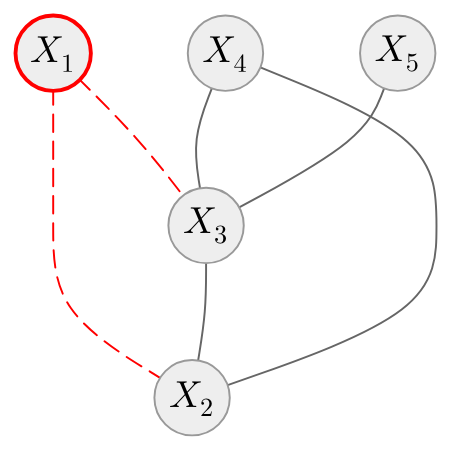

# Besag's approximation [(Besag, 1974)](https://doi.org/10.1111/j.2517-6161.1974.tb00999.x)

::left::

- Relaxes fundamental probability axioms
- Product of local conditional probability distributions
- Avoids direct partition function computation
- Retains resemblance with the dependency structure
- Approximation (pseudolikelihood)

$$
\begin{equation*}
p(\mathbf{X} \mid \boldsymbol{\theta}) \approx \prod_{V \in \mathscr{V}} p(x_V \mid \mathcal{N}_{\mathscr{G}}(V); \boldsymbol{\theta}_{X_V \mid \mathcal{N}_{\mathscr{G}}(V)})
\end{equation*}
$$

::right::

<v-switch>
<template #1>

$$
\begin{equation*}
\begin{split}
p(\mathbf{X}) \approx \, & p(X_1 \mid X_2, X_3) p(X_2 \mid X_1, X_3, X_4) \, \times \\ & p(X_3 \mid X_1, X_2, X_4, X_5) \, \times \\ & p(X_4 \mid X_2, X_3) p(X_5 \mid X_3)
\end{split}
\end{equation*}
$$

</template>

<template #2>

$$
\begin{equation*}
\begin{split}
p(\mathbf{X}) \approx \, & \color{red}{p(X_1 \mid X_2, X_3)} \color{gray}{p(X_2 \mid X_1, X_3, X_4)} \, \color{gray}{\times} \\ & \color{gray}{p(X_3 \mid X_1, X_2, X_4, X_5)} \, \color{gray}{\times} \\ & \color{gray}{p(X_4 \mid X_2, X_3)} \color{gray}{p(X_5 \mid X_3)}
\end{split}
\end{equation*}
$$

</template>

<template #3>

$$
\begin{equation*}
\begin{split}
p(\mathbf{X}) \approx \, & \color{gray}{p(X_1 \mid X_2, X_3)} \color{red}{p(X_2 \mid X_1, X_3, X_4)} \, \color{gray}{\times} \\ & \color{gray}{p(X_3 \mid X_1, X_2, X_4, X_5)} \, \color{gray}{\times} \\ & \color{gray}{p(X_4 \mid X_2, X_3)} \color{gray}{p(X_5 \mid X_3)}
\end{split}
\end{equation*}
$$

</template>

<template #4>

$$
\begin{equation*}
\begin{split}
p(\mathbf{X}) \approx \, & \color{gray}{p(X_1 \mid X_2, X_3)} \color{gray}{p(X_2 \mid X_1, X_3, X_4)} \, \color{gray}{\times} \\ & \color{red}{p(X_3 \mid X_1, X_2, X_4, X_5)} \, \color{gray}{\times} \\ & \color{gray}{p(X_4 \mid X_2, X_3)} \color{gray}{p(X_5 \mid X_3)}
\end{split}
\end{equation*}
$$

</template>

<template #5>

$$
\begin{equation*}
\begin{split}
p(\mathbf{X}) \approx \, & \color{gray}{p(X_1 \mid X_2, X_3)} \color{gray}{p(X_2 \mid X_1, X_3, X_4)} \, \color{gray}{\times} \\ & \color{gray}{p(X_3 \mid X_1, X_2, X_4, X_5)} \, \color{gray}{\times} \\ & \color{red}{p(X_4 \mid X_2, X_3)} \color{gray}{p(X_5 \mid X_3)}
\end{split}
\end{equation*}
$$

</template>

<template #6>

$$
\begin{equation*}
\begin{split}
p(\mathbf{X}) \approx \, & \color{gray}{p(X_1 \mid X_2, X_3)} \color{gray}{p(X_2 \mid X_1, X_3, X_4)} \, \color{gray}{\times} \\ & \color{gray}{p(X_3 \mid X_1, X_2, X_4, X_5)} \, \color{gray}{\times} \\ & \color{gray}{p(X_4 \mid X_2, X_3)} \color{red}{p(X_5 \mid X_3)}
\end{split}
\end{equation*}
$$

</template>

</v-switch>