# Decomposable structures [(Pearl, 1988)](https://doi.org/10.1016/C2009-0-27609-4)

::left::

- Requires chordal structures
- Tree assembly
- Product of the distributions of the maximal cliques divided by their predecessor intersections
- Avoids direct partition function computation
- Retains resemblance with the dependency structure
- Exact inference
- Running intersection property

$$
\begin{equation*}
p(\mathbf{x} \mid \boldsymbol{\theta}) = \prod_{\mathcal{C} \in \mathscr{C}} \frac{p(\mathbf{x}_{\mathcal{C}} \mid \boldsymbol{\theta}_{\mathcal{C}})}{p(\mathbf{x}_{\mathcal{C} \cap \mathcal{P}_{\mathscr{T}}(\mathcal{C})} \mid \boldsymbol{\theta}_{\mathcal{C} \cap \mathcal{P}_{\mathscr{T}}(\mathcal{C})})}
\end{equation*}
$$

::right::

<v-switch>

<template #1>

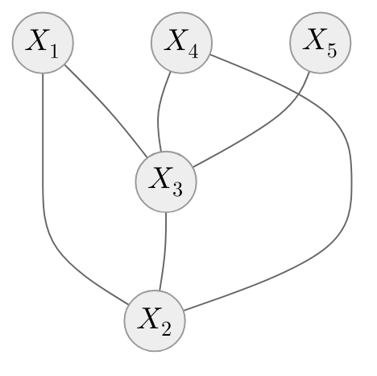

$$
\begin{equation*}
\begin{split}
p(\mathbf{X}) = \, & p(X_1, X_2, X_3) \, \times \\ & \frac{p(X_2, X_3, X_4)}{p(X_2, X_3)} \, \times \\ & \frac{p(X_3, X_5)}{p(X_3)}
\end{split}
\end{equation*}
$$

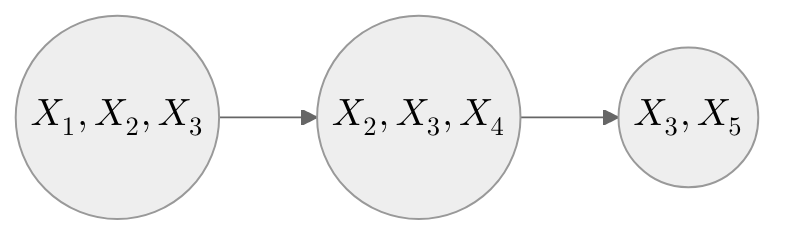

</template>

<template #2>

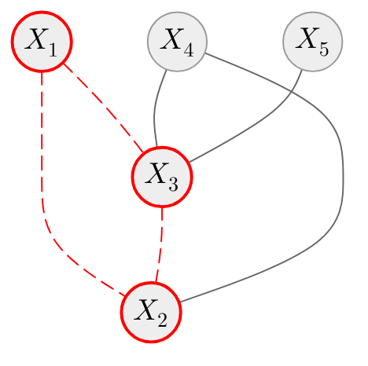

$$
\begin{equation*}
\begin{split}
p(\mathbf{X}) = \, & \color{red}{p(X_1, X_2, X_3)} \, \color{gray}{\times} \\ & \frac{\color{gray}{p(X_2, X_3, X_4)}}{\color{gray}{p(X_2, X_3)}} \, \color{gray}{\times} \\ & \frac{\color{gray}{p(X_3, X_5)}}{\color{gray}{p(X_3)}}
\end{split}
\end{equation*}
$$

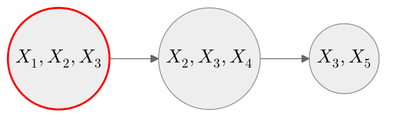

</template>

<template #3>

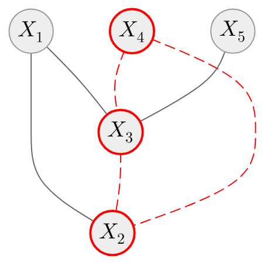

$$
\begin{equation*}
\begin{split}
p(\mathbf{X}) = \, & \color{gray}{p(X_1, X_2, X_3)} \, \color{gray}{\times} \\ & \frac{\color{red}{p(X_2, X_3, X_4)}}{\color{gray}{p(X_2, X_3)}} \, \color{gray}{\times} \\ & \frac{\color{gray}{p(X_3, X_5)}}{\color{gray}{p(X_3)}}
\end{split}
\end{equation*}
$$

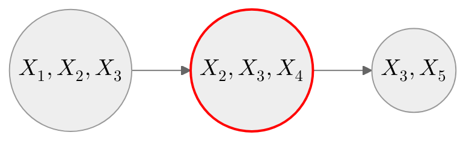

</template>

<template #4>

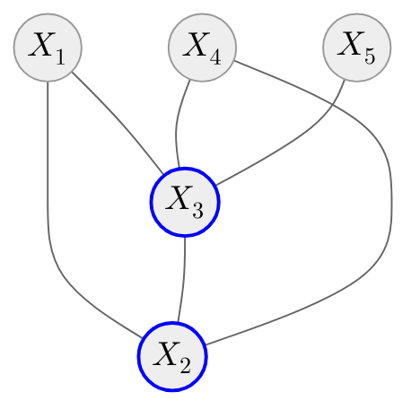

$$
\begin{equation*}
\begin{split}
p(\mathbf{X}) = \, & \color{gray}{p(X_1, X_2, X_3)} \, \color{gray}{\times} \\ & \frac{\color{red}{p(X_2, X_3, X_4)}}{\color{blue}{p(X_2, X_3)}} \, \color{gray}{\times} \\ & \frac{\color{gray}{p(X_3, X_5)}}{\color{gray}{p(X_3)}}
\end{split}
\end{equation*}
$$

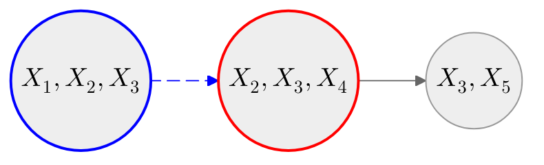

</template>

<template #5>

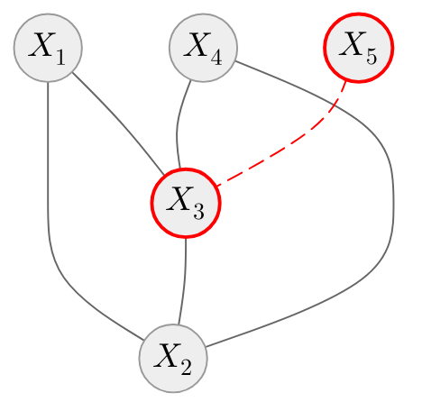

$$
\begin{equation*}
\begin{split}
p(\mathbf{X}) = \, & \color{gray}{p(X_1, X_2, X_3)} \, \color{gray}{\times} \\ & \frac{\color{gray}{p(X_2, X_3, X_4)}}{\color{gray}{p(X_2, X_3)}} \, \color{gray}{\times} \\ & \frac{\color{red}{p(X_3, X_5)}}{\color{gray}{p(X_3)}}
\end{split}
\end{equation*}
$$

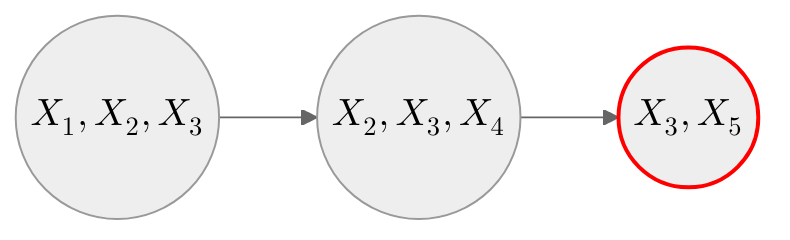

</template>

<template #6>

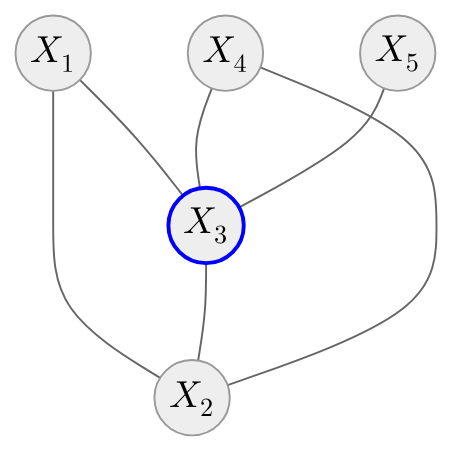

$$
\begin{equation*}
\begin{split}
p(\mathbf{X}) = \, & \color{gray}{p(X_1, X_2, X_3)} \, \color{gray}{\times} \\ & \frac{\color{gray}{p(X_2, X_3, X_4)}}{\color{gray}{p(X_2, X_3)}} \, \color{gray}{\times} \\ & \frac{\color{red}{p(X_3, X_5)}}{\color{blue}{p(X_3)}}
\end{split}
\end{equation*}
$$

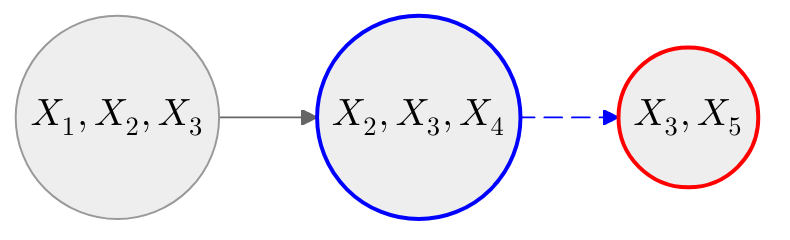

</template>

</v-switch>

---

# Decomposable structures [(Pearl, 1988)](https://doi.org/10.1016/C2009-0-27609-4)

1. **Triangulation:** convert $\mathscr{G}$ into a chordal graph by adding edges to eliminate chordless cycles.
2. **Cliques identification:** extract all maximal cliques from the chordal graph.
3. **Cliques ordering:** assign an ordering to the cliques (e.g., by the highest-indexed node within each clique).
4. **Tree assembly:** connect each clique to a predecessor clique in the ordering that shares the maximal number of nodes.

A **chordal graph** is one in which all cycles of four or more vertices have a chord, which is an edge that is not part of the cycle but connects two vertices of the cycle.