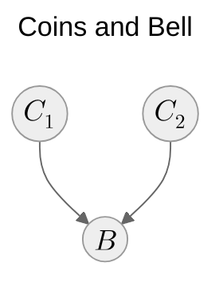
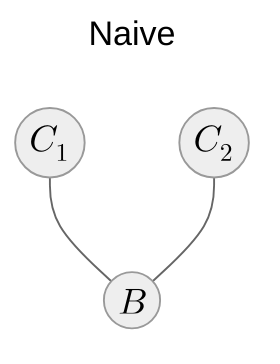
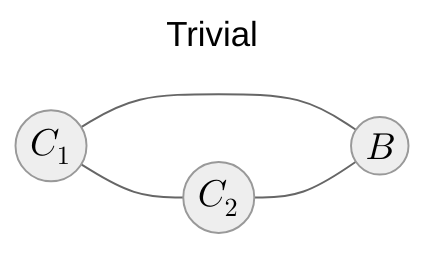

# How expressive are Bayesian networks?

::left::

## Bayesian networks

$$
\begin{align*}
C_1 & \!\perp\!\!\!\perp C_2 \\
C_1 & \not\!\perp\!\!\!\perp C_2 \mid B\\
\end{align*}
$$

::right::

## Markov random fields

$$
\begin{align*}
C_1 & \!\perp\!\!\!\perp C_2 \mid B\\
\end{align*}
$$

$$
\begin{align*}
C_1 & \not\!\perp\!\!\!\perp C_2\\
\end{align*}
$$

