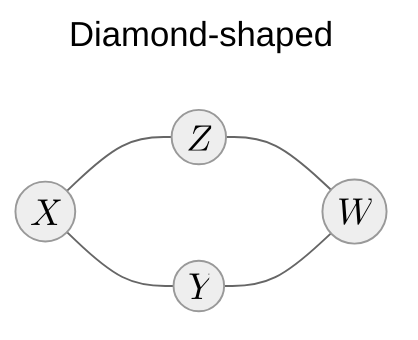
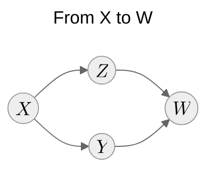
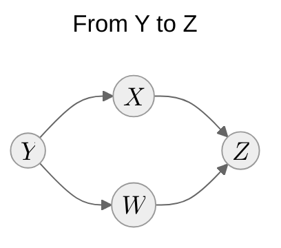

# How expressive are Markov random fields?

::left::

## Markov random fields

$$
\begin{align*}
X & \!\perp\!\!\!\perp W \mid Y, Z\\
Y & \!\perp\!\!\!\perp Z \mid X, W\\
\end{align*}
$$

::right::

## Bayesian networks

$$
\begin{align*}
X & \!\perp\!\!\!\perp W \mid Y, Z\\
Y & \not\!\perp\!\!\!\perp Z \mid X, W\\
\end{align*}
$$

$$
\begin{align*}
X & \not\!\perp\!\!\!\perp W \mid Y, Z\\
Y & \!\perp\!\!\!\perp Z \mid X, W\\
\end{align*}
$$

