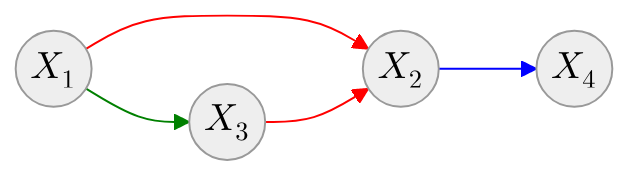
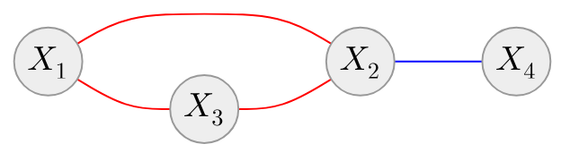

# Joint probability distribution factorization

::left::

## Bayesian networks

$$
\begin{equation*}
p(\mathbf{x} \mid \boldsymbol{\theta}) = \prod_{V \in \mathscr{V}} p(x_{V} \mid \mathcal{P}_{\mathscr{G}}(X_V) ; \boldsymbol{\theta}_{X_{V} \mid \mathcal{P}_{\mathscr{G}}(X_V)})
\end{equation*}
$$

$$
\begin{equation*}
p(\mathbf{x}) = p(X_1)\color{green}{p(X_3 \mid X_1)} \color{red}{p(X_2 \mid X_1, X_3)} \color{blue}{p(X_4 \mid X_2)}
\end{equation*}
$$

::right::

## Markov random fields

$$
\begin{equation*}
p(\mathbf{x} \mid \boldsymbol{\theta}) = \frac{1}{Z(\boldsymbol{\theta})}\prod_{\mathcal{C} \in \mathscr{C}} \psi_{\mathcal{C}}(\mathbf{x}_{\mathcal{C}} \mid \boldsymbol{\theta}_{\mathcal{C}})
\end{equation*}
$$

$$
\begin{equation*}
p(\mathbf{x}) = \frac{1}{Z} \color{red}{\psi_{\mathcal{C}_1}(X_1, X_2, X_3)} \color{blue}{\psi_{\mathcal{C}_2}(X_2, X_4)}
\end{equation*}
$$

**Partition function intractability**

