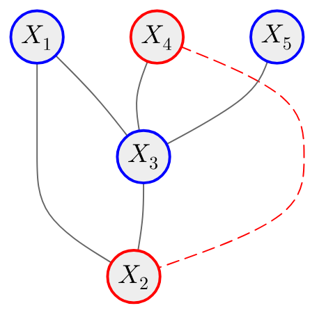

# Gaussian Markov random fields [(Rue, 2005)](https://doi.org/10.1201/9780203492024)

::left::

- Avoids direct partition function computation (normalized by definition)
- Exploits the sparsity of the precision matrix
- Pairwise Markov property (precision operator)
- Closed under marginalization and conditioning
- Implicit none tail dependence
- Gaussian marginals

$$
\begin{align*}
\mathbf{X} &\sim \textsf{multivariate normal}(\boldsymbol{\mu}, \boldsymbol{\Sigma})\\
\mathbf{\Sigma}_{ij}^{-1} & \neq 0 \iff X_i \sim_{\mathscr{G}} X_j \colon \forall i, j \in \mathscr{V}\\
X_i &\!\perp\!\!\!\perp X_j \mid \mathbf{X}_{-ij} \iff \mathbf{\Sigma}_{ij}^{-1} = 0
\end{align*}
$$

::right::

<v-switch>
<template #1>

$$
\begin{equation*}
\mathbf{\Sigma}^{-1}=\begin{bmatrix}\ast & \ast & \ast & 0 & 0 \\ \ast & \ast & \ast & \ast & 0 \\ \ast & \ast & \ast & \ast & \ast \\ 0 & \ast & \ast & \ast & 0 \\ 0 & 0 & \ast & 0 & \ast\end{bmatrix}
\end{equation*}
$$

</template>

<template #2>

$$
\begin{align*}
\mathbf{\Sigma}^{-1}&=\begin{bmatrix}\color{gray}{\ast} & \color{red}{\ast} & \color{gray}{\ast} & \color{gray}{0} & \color{gray}{0} \\ \color{red}{\ast} & \color{gray}{\ast} & \color{gray}{\ast} & \color{gray}{\ast} & \color{gray}{0} \\ \color{gray}{\ast} & \color{gray}{\ast} & \color{gray}{\ast} & \color{gray}{\ast} & \color{gray}{\ast} \\ \color{gray}{0} & \color{gray}{\ast} & \color{gray}{\ast} & \color{gray}{\ast} & \color{gray}{0} \\ \color{gray}{0} & \color{gray}{0} & \color{gray}{\ast} & \color{gray}{0} & \color{gray}{\ast}\end{bmatrix}\\
&\color{red}{X_1} \, \color{black}{\not\!\perp\!\!\!\perp} \, \color{red}{X_2} \, \color{black}{\mid} \,\color{blue}{X_3, X_4, X_5}
\end{align*}
$$

</template>

<template #3>

$$
\begin{align*}
\mathbf{\Sigma}^{-1}&=\begin{bmatrix}\color{gray}{\ast} & \color{gray}{\ast} & \color{gray}{\ast} & \color{gray}{0} & \color{gray}{0} \\ \color{gray}{\ast} & \color{gray}{\ast} & \color{red}{\ast} & \color{gray}{\ast} & \color{gray}{0} \\ \color{gray}{\ast} & \color{red}{\ast} & \color{gray}{\ast} & \color{gray}{\ast} & \color{gray}{\ast} \\ \color{gray}{0} & \color{gray}{\ast} & \color{gray}{\ast} & \color{gray}{\ast} & \color{gray}{0} \\ \color{gray}{0} & \color{gray}{0} & \color{gray}{\ast} & \color{gray}{0} & \color{gray}{\ast}\end{bmatrix}\\
&\color{red}{X_2} \, \color{black}{\not\!\perp\!\!\!\perp} \, \color{red}{X_3} \, \color{black}{\mid} \,\color{blue}{X_1, X_4, X_5}
\end{align*}
$$

</template>

<template #4>

$$
\begin{align*}
\mathbf{\Sigma}^{-1}&=\begin{bmatrix}\color{gray}{\ast} & \color{gray}{\ast} & \color{red}{\ast} & \color{gray}{0} & \color{gray}{0} \\ \color{gray}{\ast} & \color{gray}{\ast} & \color{gray}{\ast} & \color{gray}{\ast} & \color{gray}{0} \\ \color{red}{\ast} & \color{gray}{\ast} & \color{gray}{\ast} & \color{gray}{\ast} & \color{gray}{\ast} \\ \color{gray}{0} & \color{gray}{\ast} & \color{gray}{\ast} & \color{gray}{\ast} & \color{gray}{0} \\ \color{gray}{0} & \color{gray}{0} & \color{gray}{\ast} & \color{gray}{0} & \color{gray}{\ast}\end{bmatrix}\\
&\color{red}{X_1} \, \color{black}{\not\!\perp\!\!\!\perp} \, \color{red}{X_3} \, \color{black}{\mid} \,\color{blue}{X_2, X_4, X_5}
\end{align*}
$$

</template>

<template #5>

$$
\begin{align*}
\mathbf{\Sigma}^{-1}&=\begin{bmatrix}\color{gray}{\ast} & \color{gray}{\ast} & \color{gray}{\ast} & \color{gray}{0} & \color{gray}{0} \\ \color{gray}{\ast} & \color{gray}{\ast} & \color{gray}{\ast} & \color{gray}{\ast} & \color{gray}{0} \\ \color{gray}{\ast} & \color{gray}{\ast} & \color{gray}{\ast} & \color{red}{\ast} & \color{gray}{\ast} \\ \color{gray}{0} & \color{gray}{\ast} & \color{red}{\ast} & \color{gray}{\ast} & \color{gray}{0} \\ \color{gray}{0} & \color{gray}{0} & \color{gray}{\ast} & \color{gray}{0} & \color{gray}{\ast}\end{bmatrix}\\
&\color{red}{X_3} \, \color{black}{\not\!\perp\!\!\!\perp} \, \color{red}{X_4} \, \color{black}{\mid} \,\color{blue}{X_1, X_2, X_5}
\end{align*}
$$

</template>

<template #6>

$$
\begin{align*}
\mathbf{\Sigma}^{-1}&=\begin{bmatrix}\color{gray}{\ast} & \color{gray}{\ast} & \color{gray}{\ast} & \color{gray}{0} & \color{gray}{0} \\ \color{gray}{\ast} & \color{gray}{\ast} & \color{gray}{\ast} & \color{red}{\ast} & \color{gray}{0} \\ \color{gray}{\ast} & \color{gray}{\ast} & \color{gray}{\ast} & \color{gray}{\ast} & \color{gray}{\ast} \\ \color{gray}{0} & \color{red}{\ast} & \color{gray}{\ast} & \color{gray}{\ast} & \color{gray}{0} \\ \color{gray}{0} & \color{gray}{0} & \color{gray}{\ast} & \color{gray}{0} & \color{gray}{\ast}\end{bmatrix}\\
&\color{red}{X_2} \, \color{black}{\not\!\perp\!\!\!\perp} \, \color{red}{X_4} \, \color{black}{\mid} \,\color{blue}{X_1, X_3, X_5}
\end{align*}
$$

</template>

<template #7>

$$
\begin{align*}
\mathbf{\Sigma}^{-1}&=\begin{bmatrix}\color{gray}{\ast} & \color{gray}{\ast} & \color{gray}{\ast} & \color{gray}{0} & \color{gray}{0} \\ \color{gray}{\ast} & \color{gray}{\ast} & \color{gray}{\ast} & \color{gray}{\ast} & \color{gray}{0} \\ \color{gray}{\ast} & \color{gray}{\ast} & \color{gray}{\ast} & \color{gray}{\ast} & \color{red}{\ast} \\ \color{gray}{0} & \color{gray}{\ast} & \color{gray}{\ast} & \color{gray}{\ast} & \color{gray}{0} \\ \color{gray}{0} & \color{gray}{0} & \color{red}{\ast} & \color{gray}{0} & \color{gray}{\ast}\end{bmatrix}\\
&\color{red}{X_3} \, \color{black}{\not\!\perp\!\!\!\perp} \, \color{red}{X_5} \, \color{black}{\mid} \,\color{blue}{X_1, X_2, X_4}
\end{align*}
$$

</template>

</v-switch>

---

# Gaussian Markov random fields [(Rue, 2005)](https://doi.org/10.1201/9780203492024)

$$
\begin{equation*}
\ell(\boldsymbol{\theta}) -\frac{d}{2} \log(2\pi) - \frac{1}{2} \log\left(|\mathbf{\Sigma}(\boldsymbol{\theta})|\right) -\frac{1}{2} (\mathbf{x} - \boldsymbol{\mu})^\mathrm{T} \, \mathbf{\Sigma}(\boldsymbol{\theta})^{-1} \, (\mathbf{x} - \boldsymbol{\mu})
\end{equation*}
$$

- $\mathbf{\Sigma}(\boldsymbol{\theta})^{-1}$ is SPD
- Sparse matrices
- Cholesky decomposition $\mathbf{\Sigma} = \mathbf{L}_{\mathbf{\Sigma}} \mathbf{L}_{\mathbf{\Sigma}}^{\mathrm{T}}$
- Split into autoregressive processes