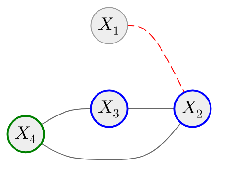
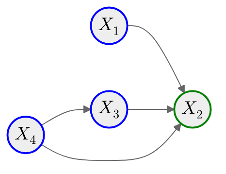

# Graph theory

::left::

## Undirected graphs

$$
\begin{align*}
G &= \{V, E\}\\
V &= \{X_1, X_2, X_3, X_4\}\\
E &= \left\{  \{X_1, X_2\}, \{X_2, X_3\}, \{X_3, X_4\}, \{X_2, X_4\} \right\}\\
\color{red}{X_1} & \, \color{red}{\sim_{G} X_2}\\
\mathcal{N}_{G}(\color{green}{X_4}\color{black}{)} &= \color{blue}{\{X_2, X_3\}}
\end{align*}
$$

::right::

## Directed graphs

$$
\begin{align*}
G &= \{V, E\}\\
V &= \{X_1, X_2, X_3, X_4\}\\
E &= \{(X_1, X_2), (X_3, X_2), (X_4, X_3), (X_4, X_2)\}\\
\mathcal{P}_{G}(\color{green}{X_2}\color{black}{)} &= \color{blue}{\{X_1, X_3, X_4\}}
\end{align*}
$$

