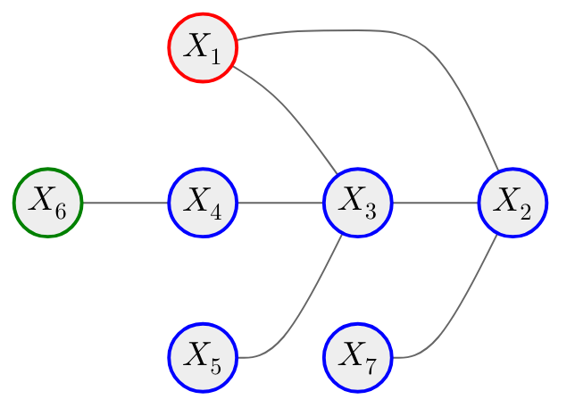
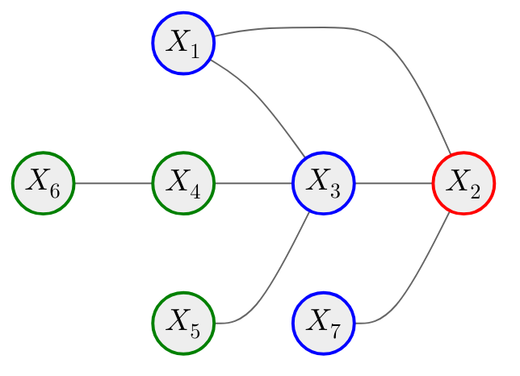
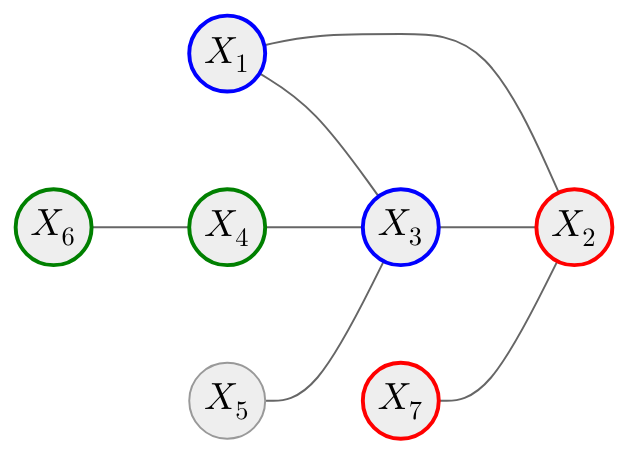

# Markov properties

<v-switch>

<template #1>

## Pairwise Markov property

$$
\begin{equation*}
\text{Any} \, X_i \not\sim_{\mathscr{G}} X_j \colon X_i \!\perp\!\!\!\perp X_j \mid \mathbf{X}_{-ij}
\end{equation*}
$$

$$
\begin{equation*}
\color{red}{X_1} \, \color{black}{\!\perp\!\!\!\perp} \, \color{green}{X_6} \, \color{black}{\mid} \, \color{blue}{\{X_2, X_3, X_4, X_5, X_7\}}
\end{equation*}
$$

</template>

<template #2>

## Local Markov property

$$
\begin{equation*}
X \!\perp\!\!\!\perp \mathscr{V} \setminus \mathcal{N}_{\mathscr{G}}[X] \mid \mathcal{N}_{\mathscr{G}}(X)
\end{equation*}
$$

$$
\begin{equation*}
\color{red}{X_2} \, \color{black}{\!\perp\!\!\!\perp} \, \color{green}{\{X_4, X_5, X_6\}} \, \color{black}{\mid} \, \color{blue}{\{X_1, X_3, X_7\}}
\end{equation*}
$$

</template>

<template #3>

## Global Markov property

$$
\begin{equation*}
\mathbf{X}_A \!\perp\!\!\!\perp \mathbf{X}_B \mid \mathbf{X}_S
\end{equation*}
$$

$$
\begin{equation*}
\color{red}{\{X_2, X_7\}} \, \color{black}{\!\perp\!\!\!\perp} \, \color{green}{\{X_4, X_6\}} \, \color{black}{\mid} \, \color{blue}{\{X_1, X_3\}}
\end{equation*}
$$

</template>

</v-switch>