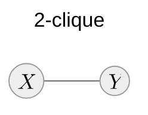
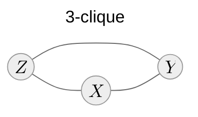
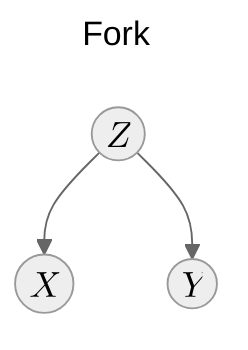
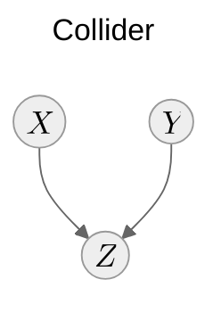

# Structured probabilistic models

- Multivariate systems
- Joint probability distribution representation
- Conditional (in)dependence assumptions encoded by the structure
- Factorization

::left::

## Markov random fields (MRFs)

::right::

## Bayesian networks (BNs)

